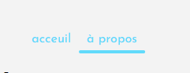
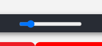
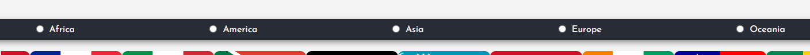
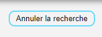

# English course 04/10/2024

## Table of Contents

1. [Introduction](#introduction)
2. [Installation](#installation)
3. [Project Structure](#project-structure)
4. [Available Scripts](#available-scripts)
5. [Features](#features)
6. [Usage](#usage)
7. [Testing](#testing)
8. [Contributing](#contributing)
9. [License](#license)

---

## Introduction

It's a React-based application designed to provide information on every country in the world. Information such as name, capital and number of inhabitants. This documentation provides a guide to setting up, using and contributing to the project.

## Installation

To install the project dependencies, run the following commands:

```bash
1. git clone https://github.com/TerryHenrard/react-countries-app
2. cd react-countries-app
3. npm install (or npm i)
```

### Prerequisites

```bash
1. Node.js (version 14.0 or higher)
2. npm or pnpm or yarn
```

## project-structure

```bash
/react-countries-app
│
├── /public
│   └── index.html          # Base HTML file
│
├── /src
│   ├── /assets             # All assets used in
│   │   ├── /fonts
│   │   └── /img
│   ├── /components         # Reusable components
│   ├── /pages              # Application pages
│   ├── /styles             # SCSS styles
│   │   └── /components
│   ├── App.js              # Main application component
│   └── index.js            # Entry point of the app
│
├── package.json            # Dependencies and scripts
└── README.md               # Project documentation
```

## Available Scripts

In the project directory, you can run the following scripts:

`npm start`
Runs the app in development mode. Open <http://localhost:3000> to view it in the browser.

`npm test`
Launches the test runner in interactive watch mode. Add tests in the /tests folder.

`npm run build`
Builds the app for production to the build folder. This will bundle and optimize your app for deployment.

`npm run eject`
If you need to customize the configuration files, you can use the eject script. ==Note: this action is irreversible.==

## Features

1. navigation: Simple bar navigation, allowing the user to switch between pages.


2. limit number of country displayed: Input type range, allowing the user to limit or not the number of country displayed.


3. Filter country by continent: Input type radio, allowing the user to display contry from a specific continent.


4. Reset filter: Button, allowing the user to reset the continent filter and so displaying all countries no matter the continer.


## Usage

Once the app is running, follow these steps to use the core features:

1. Navigate to accueil (default page) by clicking on __==acceuil==__.
2. To limit the number of country displayed grab the cursor on the nav bar and move it right or left.
3. To filter the country by continent, simply click on the continent you want.
4. To reset the filter, click on the button __=="Annuler la recherche"==__

## Testing

The application uses Jest to ensure code quality. To run the tests:

```bash
npm test
```

Write your test files under the /tests directory, following this structure:

```bash
/tests
├── /components
├── /pages
└── App.test.js

```

## Contributing

Contributions, issues, and feature requests are welcome!

To contribute:

1. Fork the repository
2. Create a new branch (`git checkout -b feature/your-feature`)
3. Make your changes
4. Push to your branch (`git push origin feature/your-feature`)
5. Open a pull request

## License

This project is licensed under the MIT License.

### Key Sections Breakdown

- __Introduction__: Explains what the app does.
- __Installation__: Shows how to set up the project locally.
- __Project Structure__: Brief overview of the folder structure.
- __Available Scripts__: Lists essential `npm` scripts for development.
- __Environment Variables__: How to configure environment variables.
- __Features__: List of key app features.
- __Usage__: How to use the app and navigate through it.
- __Testing__: Instructions for running tests.
- __Deployment__: Steps to deploy the app to a live environment.
- __Contributing__: Guidelines for contributing to the project.
- __License__: States the project’s licensing information.

Let me know if you'd like to modify or expand any specific section!
